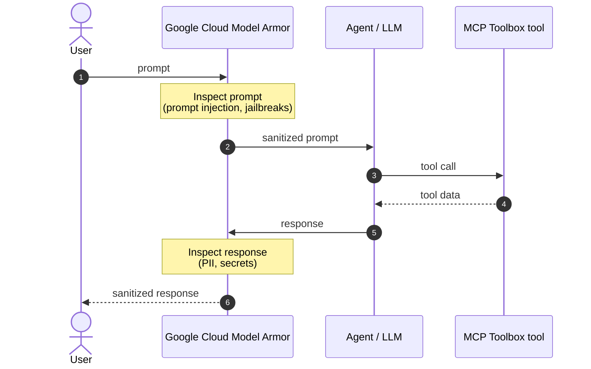

## About

[Google Cloud Model Armor](https://cloud.google.com/security/products/model-armor) is
an LLM-agnostic service that screens prompts and responses to defend AI
applications against prompt injection, jailbreaks, and sensitive data leakage.
Pairing it with MCP Toolbox lets you screen both the prompts your users send and
the responses your agent returns, including any sensitive data pulled from your
tools, without trusting the model to police itself.

Model Armor inspects traffic at two points:

- **Ingress (incoming prompt):** The user prompt is screened *before* it reaches
  the agent, blocking prompt injection and jailbreak attempts.
- **Egress (outgoing response):** The agent's response, including any sensitive
  data pulled in from tools, is screened *before* it returns to the user, masking
  or blocking PII and secrets.




Like other [pre- and post-processing](../configuration/pre-post-processing/)
guardrails, these checks live in your orchestration layer (LangChain, ADK, Agent
Gateway), not in the Toolbox SDK itself. Toolbox tools are designed to work
cleanly with this kind of interception.


## Requirements

1. **Install the gcloud CLI.** Install and initialize the
   [Google Cloud CLI](https://cloud.google.com/sdk/docs/install) so you can
   create and manage Model Armor templates.
2. **Enable the API.** Enable `modelarmor.googleapis.com` in your Google Cloud
   project.
   ```bash
   gcloud config set project YOUR_PROJECT_ID
   gcloud services enable modelarmor.googleapis.com
   ```
3. **Grant IAM roles.** 
    - The identity that runs your agent needs `roles/modelarmor.user` to invoke sanitization. 
    - To create and manage templates, you need `roles/modelarmor.admin`.

## Step 1: Configure a Model Armor template

Model Armor applies its filters through a **template** that bundles your
detection settings into a reusable policy. You create a template once, then
reference its ID on every sanitize call, so you can change the policy in one
place without touching your agent code. Create a template that enforces both
Sensitive Data Protection (SDP) and prompt injection / jailbreak detection:

```bash
gcloud model-armor templates create my-mcp-template \
    --location=us-central1 \
    --project=YOUR_PROJECT_ID \
    --basic-config-filter-enforcement=enabled \
    --pi-and-jailbreak-filter-settings-enforcement=enabled \
    --pi-and-jailbreak-filter-settings-confidence-level=medium-and-above
```


Basic SDP automatically scans for high-confidence secrets such as credit card
numbers, API keys, and passwords. For granular PII detection and masking, use an
advanced SDP configuration with `--advanced-config-inspect-template`. See
[Sanitize prompts and responses](https://docs.cloud.google.com/model-armor/sanitize-prompts-responses#advanced_sdp_configuration)
for details.

For more information on how to create templates for Model Armor, refer to the [official docs](https://docs.cloud.google.com/model-armor/manage-templates#create-ma-template).


## Step 2: Secure ingress and egress


{}

If your agent uses LangChain, the `langchain-google-community` package provides
runnables and middleware that screen prompts and responses with Model Armor.

1. Install the dependencies:

    ```bash
    pip install "langchain>=1.0" "langchain-google-community>=3.0.4" langchain-google-genai toolbox-langchain
    ```

2. Create an **ingress** sanitizer for user prompts and an **egress** sanitizer
   for responses. Set `fail_open=False` so execution is blocked when a threat is
   detected:

    ```python
    from langchain_google_community.model_armor import (
        ModelArmorSanitizePromptRunnable,
        ModelArmorSanitizeResponseRunnable,
    )

    PROJECT_ID = "YOUR_PROJECT_ID"
    LOCATION = "us-central1"
    TEMPLATE_ID = "my-mcp-template"

    # Ingress: screen the user prompt before it reaches the model.
    sanitize_prompt = ModelArmorSanitizePromptRunnable(
        project=PROJECT_ID,
        location=LOCATION,
        template_id=TEMPLATE_ID,
        fail_open=False,
    )

    # Egress: screen the response before it returns to the user.
    sanitize_response = ModelArmorSanitizeResponseRunnable(
        project=PROJECT_ID,
        location=LOCATION,
        template_id=TEMPLATE_ID,
        fail_open=False,
    )
    ```

3. For a simple chain, place the sanitizers around the model. A blocked prompt or
   response raises `ValueError`:

    ```python
    from langchain_google_genai import ChatGoogleGenerativeAI

    llm = ChatGoogleGenerativeAI(model="gemini-2.5-flash")
    chain = sanitize_prompt | llm | sanitize_response

    try:
        result = chain.invoke("Summarize today's bookings.")
        print(result.content)
    except ValueError as e:
        print(f"Model Armor blocked the content: {e}")
    ```

4. For an agent that calls Toolbox tools, wrap the sanitizers in
   `ModelArmorMiddleware` and pass it to `create_agent`. This screens the
   intermediate tool calls and responses (agent-to-tool egress) in addition to
   the user-facing prompt and answer:

    
  `create_agent` and the `middleware` parameter are part of
  [LangChain v1.0](https://docs.langchain.com/oss/python/releases/langchain-v1)
  (`langchain>=1.0`). On older releases, agents were built with
  `create_react_agent` / `create_tool_calling_agent`, which do not support
  middleware. Upgrade to v1.0 to use this pattern.
    

    ```python
    import asyncio

    from langchain.agents import create_agent
    from langchain_google_community.model_armor import ModelArmorMiddleware
    from langchain_google_genai import ChatGoogleGenerativeAI
    from toolbox_langchain import ToolboxClient


    async def main():
        async with ToolboxClient("http://127.0.0.1:5000") as client:
            tools = await client.aload_toolset("my-toolset")

            model_armor = ModelArmorMiddleware(
                prompt_sanitizer=sanitize_prompt,
                response_sanitizer=sanitize_response,
            )

            agent = create_agent(
                model=ChatGoogleGenerativeAI(model="gemini-2.5-flash"),
                tools=tools,
                middleware=[model_armor],
            )

            response = await agent.ainvoke(
                {"messages": [{"role": "user", "content": "Find hotels in Basel."}]}
            )
            print(response["messages"][-1].content)


    if __name__ == "__main__":
        asyncio.run(main())
    ```

For more on the middleware, see the
[Model Armor LangChain integration](https://docs.cloud.google.com/model-armor/model-armor-langchain-integration).

{}


## Additional Resources

- [Model Armor overview](https://docs.cloud.google.com/model-armor/overview)
- [Sanitize prompts and responses](https://docs.cloud.google.com/model-armor/sanitize-prompts-responses)
- [Model Armor LangChain integration](https://docs.cloud.google.com/model-armor/model-armor-langchain-integration)
- [Codelab: Secure your agent with Model Armor](https://codelabs.developers.google.com/secure-agent-modelarmor#9)
- [Toolbox pre- and post-processing](../configuration/pre-post-processing/)
