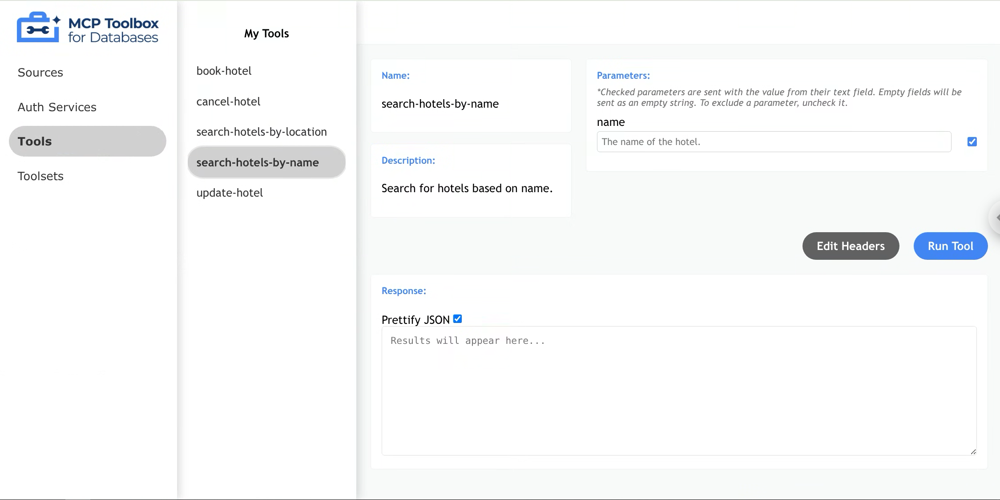
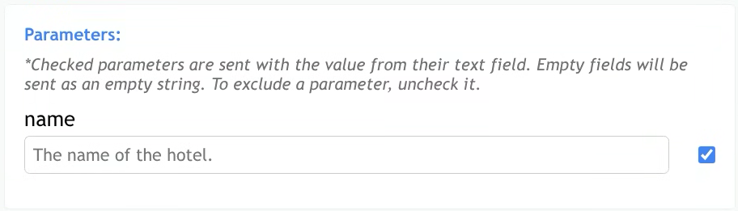
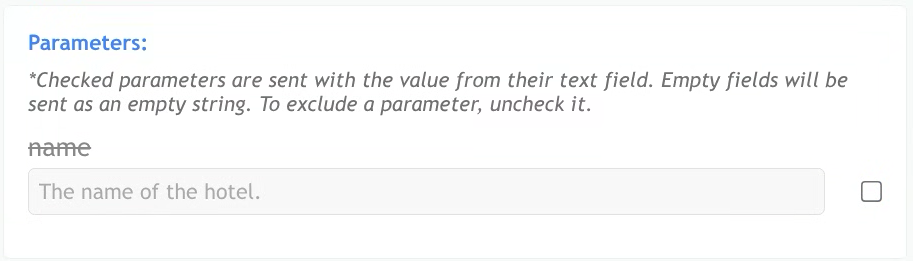
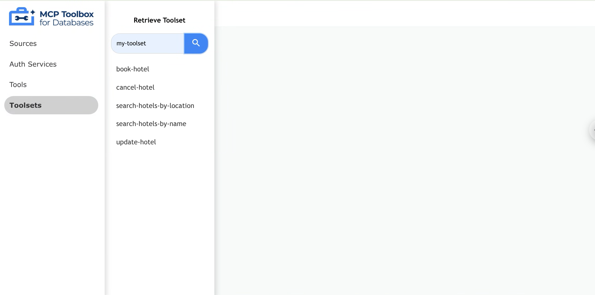
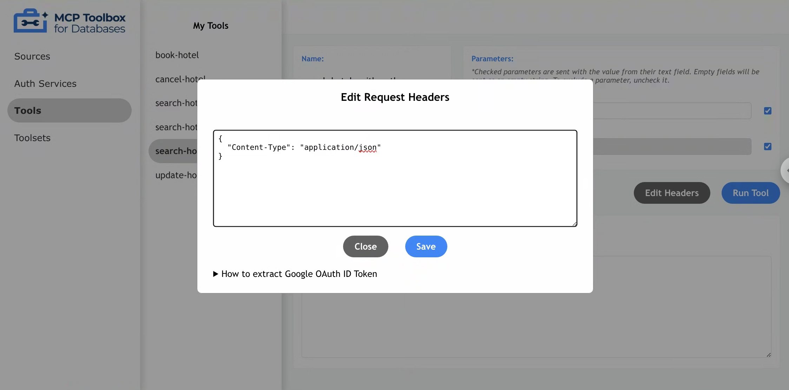

## Toolbox UI

Toolbox includes a built-in web interface that allows users to test out tools
and toolsets, which can help to speed up development. 

### Launching Toolbox UI

To launch Toolbox's interactive UI, use the `--ui` flag.

```sh
./toolbox --ui
```

Toolbox UI will be served from the same port as the Toolbox server, with the `/ui` suffix. On the default
port 5000, Toolbox UI will be accessible via navigating to [localhost:5000/ui](https://localhost:5000/ui) on a browser.

### Navigating the Tools Page

The tools page shows all tools loaded from your configuration file. This corresponds to the default toolset (represented by an empty string). Each tool's name on this page will exactly match its name in the configuration 
file.

To view details for a specific tool, click on the tool name. The main content area will be populated
with the tool name, description, and available parameters.



#### Excluding Parameters

Toolbox UI also supports explicitly testing tool invocations without certain parameters. To exclude a
parameter, uncheck the box to the right of an associated parameter, and that parameter will not be
included in the request body.

If the box is checked, this indicates the parameter will be sent exactly as entered in the response field.
For strings, an empty field gets sent as an empty string. For other required parameter types, an empty field 
will display an error message.

Optional parameter included (default):



Optional parameter excluded (will not be sent in request body):



#### Running Tools

To run a tool, press the "Run Tool" button. The UI will send the configured request to the Toolbox API's invoke endpoint. The API response or any error message will be displayed in the "Response" section at the bottom of the page.

### Navigating the Toolsets Page

Through the toolsets page, users can search for a specific toolset to retrieve tools from. Simply
enter the toolset name in the search bar, and press "Enter" to retrieve the associated tools.

If the toolset name is not defined within the tools configuration file, an error message will be 
displayed.



### Editing Headers

To edit headers, press the "Edit Headers" button to display the header modal. Within this modal,
users can make direct edits by typing into the header's text area. 

Toolbox UI validates that the headers are in correct JSON format. Other header-related errors (e.g.,
incorrect header names or values required by the tool) will be reported in the Response section 
after running the tool.



#### Google OAuth

Currently, Toolbox supports Google OAuth 2.0 as an AuthService, which allows tools to utilize 
authorized parameters. When a tool uses an authorized parameter, the parameter will be displayed
but not editable, as it will be populated from the authentication token.  

To provide the token, add your Google OAuth ID Token to the request header using the "Edit Headers"
button and modal described above. The key should be the name of your AuthService as defined in 
your tool configuration file, suffixed with `_token`. The value should be your ID token as a string.

```json
{
  "Content-Type": "application/json",
  "my-google-auth_token": "YOUR_ID_TOKEN_HERE"
}
```