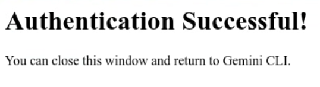

## Overview

Gemini-CLI can be configured to get an OAuth access token from the Google OAuth endpoint, then send this token to MCP Toolbox as part of the request. MCP Toolbox can then use this token to authentincate with BigQuery. This enables each user to access Toolbox with thier own IAM identity for a Toolbox multi-tenancy use case.


This feature requires Toolbox v0.14.0 or later.


## Step 1: Register the OAuth on GCP

You first need to register the OAuth application following this [guide](register-oauth) to get a client ID and client secret.

## Step 2: Install and configure Toolbox

In this section, we will download Toolbox and run the Toolbox server.

1. Download the latest version of Toolbox as a binary:

    
   Select the
   [correct binary](https://github.com/googleapis/genai-toolbox/releases)
   corresponding to your OS and CPU architecture.
    
    <!-- {x-release-please-start-version} -->
    ```bash
    export OS="linux/amd64" # one of linux/amd64, darwin/arm64, darwin/amd64, or windows/amd64
    curl -O https://storage.googleapis.com/genai-toolbox/v0.14.0/$OS/toolbox
    ```
    <!-- {x-release-please-end} -->

1. Create a `tools.yaml` file and include the following BigQuery source configuration:

    ```yaml
    sources:
        my-bigquery-client-auth-source:
            kind: "bigquery"
            project: "my-project-id"
            useClientOAuth: true
            # location: "US" # Optional: Specifies the location for query jobs.
            # allowedDatasets: # Optional: Restricts tool access to a specific list of datasets.
            #   - "my_dataset_1"
            #   - "other_project.my_dataset_2"
    ```

1. Continue to configure one or more BigQuery tools. Here is a naive example to get started:

    ```yaml
    tools:
        naive-bq-tool:
            kind: "bigquery-sql"
            source: "my-bigquery-client-auth-source"
            description: Naive BQ Tool that returns 1.
            statement: |
            SELECT 1;
    ```

1. Run the Toolbox server:

    ```bash
    ./toolbox --tools-file "tools.yaml"

    ```

    The toolbox server will begin listening on localhost port 5000. Leave it
    running and continue in another terminal.

    Later, when it is time to shut everything down, you can quit the toolbox
    server with Ctrl-C in this terminal window.

## Step 3: Configure Gemini-CLI

1. Edit the file `~/.gemini/settings.json` to include the following configuration:

    ```json
    "mcpServers": {
        "toolbox": {
            "httpUrl": "<http://localhost:5000/mcp>", // Replace this with your Toolbox URL if deployed somewhere else.
            "oauth": {
                "enabled": true,
                "clientId": <YOUR_CLIENT_ID>,
                "clientSecret": <YOUR_CLIENT_SECRET>,
                "authorizationUrl": "<https://accounts.google.com/o/oauth2/v2/auth>",
                "tokenUrl": "<https://oauth2.googleapis.com/token>",
                "scopes": ["https://www.googleapis.com/auth/cloud-platform"]
            }
        }
    }
    ```

    Make sure to substitue your client ID and client secret received from step 1.

1. Start Gemini-CLI:

    ```shell
    gemini-cli
    ```

1. Authenticate with the command `/mcp auth toolbox`. Gemini-CLI will open up a
   browser where you will log in to your Google account.

   

1. Use Gemini-CLI with your tools. To test the naive Tool we configured previously, ask Gemini to run this Tool:

    ```text
    Call naive-bq-tool
    ```

## Using Toolbox as a Shared Service

Toolbox can be run on another server as a shared service accessed by multiple
users. We strongly recommend running toolbox behind a web proxy such as `nginx`
which will provide SSL encryption. Google Cloud Run is another good way to run
toolbox. You will connect to a service like `https://toolbox.example.com/mcp`.
The proxy server will handle the SSL encryption and certificates. Then it will
foward the requests to `http://localhost:5000/mcp` running in that environment.
The details of the config are beyond the scope of this document, but will be
familiar to your system administrators.

To use the shared service, just change the `localhost:5000` in the `httpUrl` in
`~/.gemini/settings.json` to the host name and possibly the port of the shared
service.
