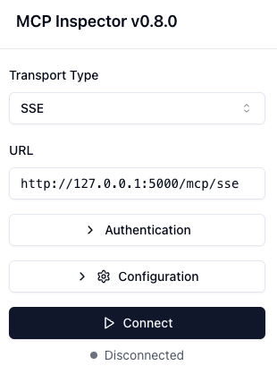

## Overview

[Model Context Protocol](https://modelcontextprotocol.io) is an open protocol
that standardizes how applications provide context to LLMs. Check out this page
on how to [connect to Toolbox via MCP](../../how-to/connect_via_mcp.md).

## Step 1: Get a Looker Client ID and Client Secret

The Looker Client ID and Client Secret can be obtained from the Users page of
your Looker instance. Refer to the documentation
[here](https://cloud.google.com/looker/docs/api-auth#authentication_with_an_sdk).
You may need to ask an administrator to get the Client ID and Client Secret
for you.

## Step 2: Install and configure Toolbox

In this section, we will download Toolbox and run the Toolbox server.

1. Download the latest version of Toolbox as a binary:

    
   Select the
   [correct binary](https://github.com/googleapis/genai-toolbox/releases)
   corresponding to your OS and CPU architecture.
    
    <!-- {x-release-please-start-version} -->
    ```bash
    export OS="linux/amd64" # one of linux/amd64, darwin/arm64, darwin/amd64, or windows/amd64
    curl -O https://storage.googleapis.com/genai-toolbox/v0.16.0/$OS/toolbox
    ```
    <!-- {x-release-please-end} -->

1. Make the binary executable:

    ```bash
    chmod +x toolbox
    ```

1. Create a file `looker_env` with the settings for your
   Looker instance. Use the Client ID and Client Secret
   you obtained earlier.

   ```bash
    export LOOKER_BASE_URL=https://looker.example.com
    export LOOKER_VERIFY_SSL=true
    export LOOKER_CLIENT_ID=Q7ynZkRkvj9S9FHPm4Wj
    export LOOKER_CLIENT_SECRET=P5JvZstFnhpkhCYy2yNSfJ6x
   ```

   In some instances you may need to append `:19999` to
   the LOOKER_BASE_URL.

1. Load the looker_env file into your environment.

   ```bash
   source looker_env
   ```

1. Run the Toolbox server using the prebuilt Looker tools.

    ```bash
    ./toolbox --prebuilt looker
    ```

## Step 3: Connect to MCP Inspector

1. Run the MCP Inspector:

    ```bash
    npx @modelcontextprotocol/inspector
    ```

1. Type `y` when it asks to install the inspector package.

1. It should show the following when the MCP Inspector is up and running:

    ```bash
    🔍 MCP Inspector is up and running at http://127.0.0.1:5173 🚀
    ```

1. Open the above link in your browser.

1. For `Transport Type`, select `SSE`.

1. For `URL`, type in `http://127.0.0.1:5000/mcp/sse`.

1. Click Connect.

    

1. Select `List Tools`, you will see a list of tools.

    

1. Test out your tools here!
